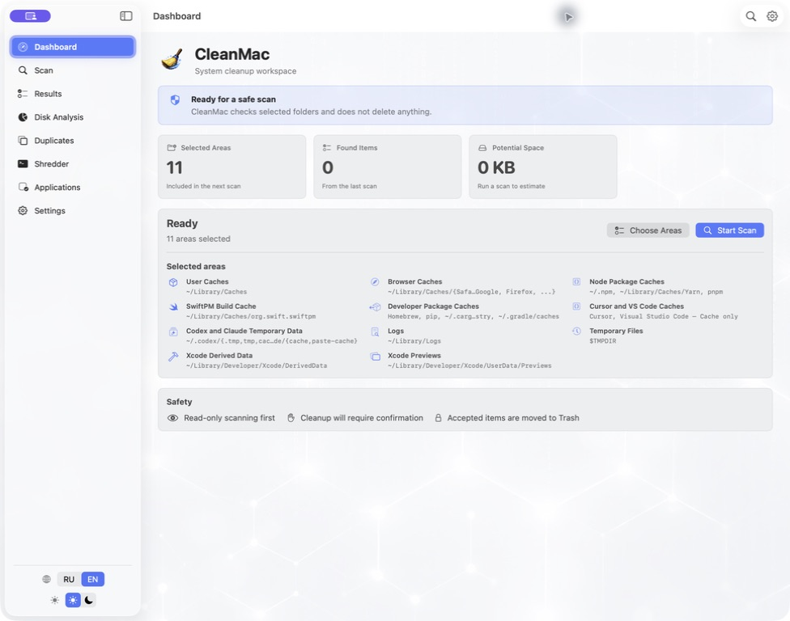
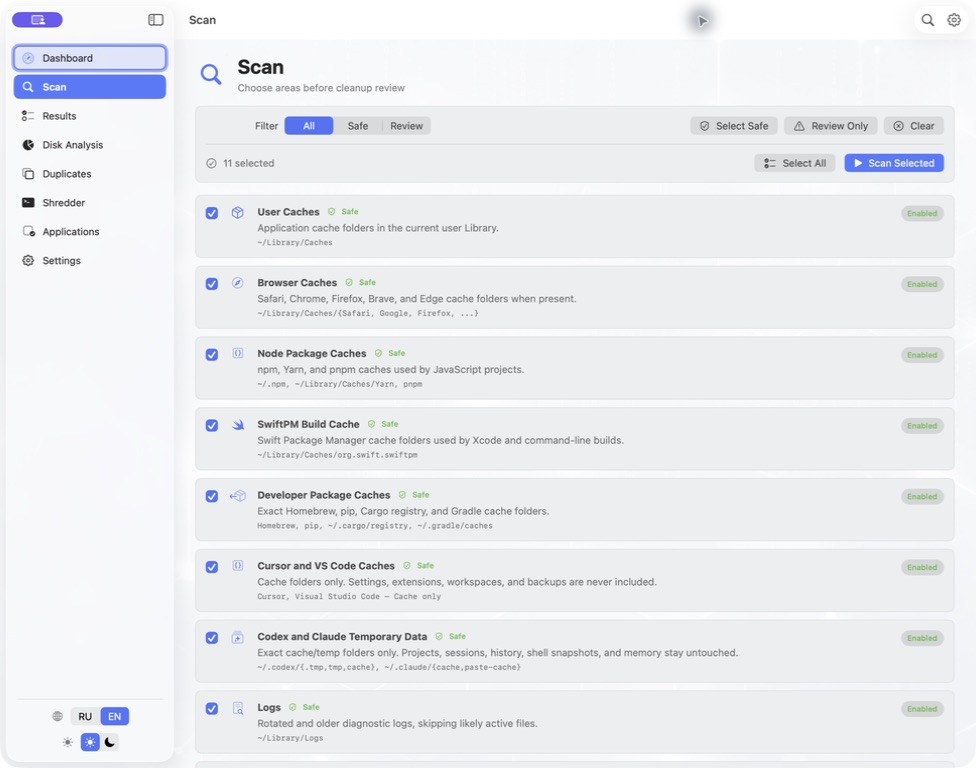
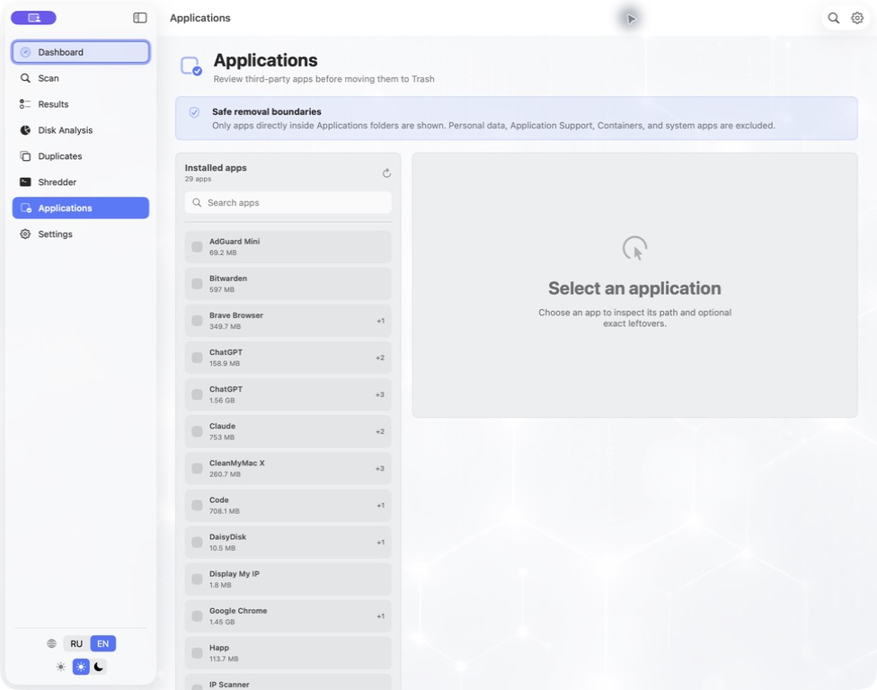
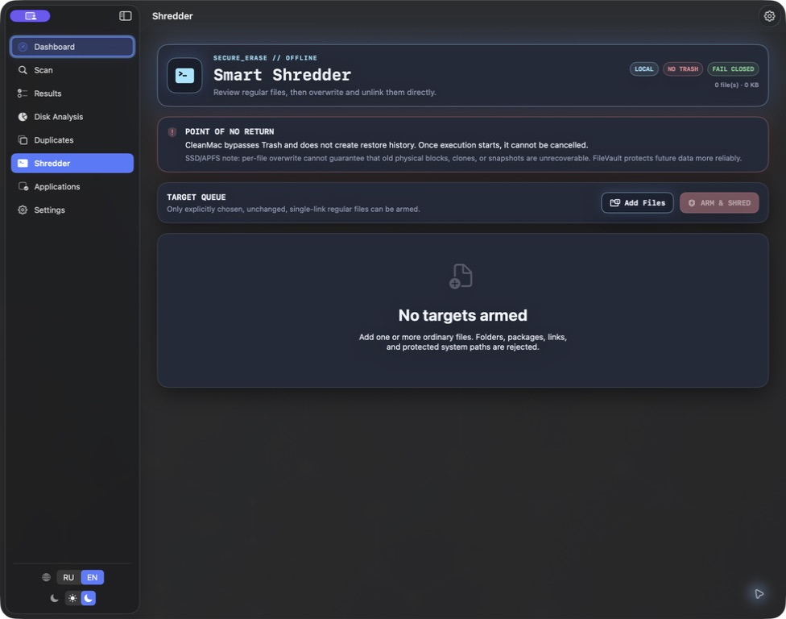

<p align="center">
  
</p>

<h1 align="center">CleanMac</h1>

<p align="center">
  Safe, local-first cleanup for macOS with review-first scanning,<br>
  Safe Mode, Trash-based cleanup, and an isolated Smart Shredder.
</p>

<p align="center">
  <a href="https://github.com/Dezoff-max/CleanMac/actions/workflows/ci.yml"></a>
  <a href="https://github.com/Dezoff-max/CleanMac/releases/latest"></a>
  
  
  <a href="LICENSE"></a>
</p>

CleanMac is a native SwiftUI utility that scans selected macOS locations, explains every cleanup candidate, and moves confirmed cleanup items to Trash. An isolated Smart Shredder is available only for files the user selects explicitly. Everything runs locally: the code contains no scan-result uploads, analytics, or cloud accounts.

> [!IMPORTANT]
> The current public build is ad-hoc signed and is not notarized by Apple. macOS Gatekeeper may block the downloaded app. You can build CleanMac from source for development; do not disable system security to run an unsigned file.

## Interface

<p align="center">
  
</p>

| Scan area selection | Application review |
| --- | --- |
|  |  |

<p align="center">
  <strong>Smart Shredder</strong><br>
  
</p>

## Features

- **Safe scanning.** User and browser caches, logs, temporary files, Xcode Derived Data, Node/SwiftPM caches, Downloads, installers, and Trash.
- **Explainable review.** Categories, sizes, risk levels, recommendation reasons, exact paths, and locations that could not be read.
- **Safe Mode.** Enabled by default and prevents selection of items that require manual review.
- **Trash-based cleanup.** Normal cleanup, duplicate removal, and application removal validate accepted paths again and move them to Trash.
- **Smart Shredder.** A separate hacker-style workspace performs best-effort overwrite and direct deletion only after file review, acknowledgement, and an exact typed phrase. It rejects folders, links, packages, protected roots, and changed files.
- **Session restore.** Items moved during the current session can be restored when their original path is available.
- **Application removal.** Finds third-party apps in `/Applications` and `~/Applications`, supports multi-selection, and offers optional exact bundle-ID leftovers.
- **Menu bar and scheduled scans.** Disk status, the latest scan summary, safe scan scheduling, and local notifications while CleanMac is running.
- **Permission visibility.** Live Full Disk Access and Finder Automation status without automatic permission prompts.
- **English and Russian UI.** Switch language and light/dark appearance directly inside the app.

## Safety Model

1. Scanning is read-only.
2. Every candidate belongs to a known category and an allowlisted root path.
3. Cleanup requires explicit selection and a separate confirmation.
4. Paths are validated again immediately before execution.
5. Normal cleanup files are moved to Trash instead of being permanently deleted.
6. During application removal, the `.app` bundle is moved first. Its leftovers remain untouched if that step fails.
7. Smart Shredder is isolated from scans, recommendations, scheduling, Trash history, and restore. Its direct deletion is intentionally irreversible at the filesystem level, but physical erasure cannot be guaranteed on SSD/APFS.
8. CleanMac does not escalate privileges or install a system helper.

## Installation

Download the latest archive from [GitHub Releases](https://github.com/Dezoff-max/CleanMac/releases/latest). Each ZIP is published with a `.sha256` file:

```bash
shasum -a 256 CleanMac-*.zip
```

Compare the resulting hash with the first value in the attached `.sha256` file. Then extract the archive and move `CleanMac.app` to `/Applications`.

Current prebuilt release limitations:

- macOS 14 or later;
- Apple Silicon (`arm64`);
- ad-hoc signed and not notarized by Apple.

## macOS Permissions

CleanMac requests access only after a user action:

- **Files and Folders** — for selected user locations;
- **Full Disk Access** — optional, for deeper checks of protected metadata;
- **Finder Automation** — optional, only for revealing a selected item in Finder.

Scanning and cleanup do not require Finder Automation. Permission status is available on the Permissions screen and can be changed in macOS System Settings.

## Build from Source

Requires macOS 14+ and Xcode 26+.

```bash
git clone https://github.com/Dezoff-max/CleanMac.git
cd CleanMac
./script/build_and_run.sh --verify
```

Run the core test suite:

```bash
swift test --package-path CleanMacCore
```

Create a local Release ZIP and SHA-256 file:

```bash
./script/package_release.sh
```

Developer ID signing and notarization are documented in [docs/signing-notarization.md](docs/signing-notarization.md).

## Project Structure

```text
CleanMac/             SwiftUI macOS application
CleanMacCore/         Testable scanning and cleanup core
script/               Build, launch, and release packaging
docs/                 Documentation and screenshots
.github/workflows/    CI and GitHub Release automation
```

## Contributing

1. Create a focused branch from `main`.
2. Preserve the standard safety flow: scan → review → confirm → Trash. Keep irreversible actions isolated inside Smart Shredder.
3. Add tests for changes to scanning, path validation, or removal behavior.
4. Before opening a pull request, run `swift test --package-path CleanMacCore` and `./script/build_and_run.sh --verify`.

Bug reports and feature ideas are welcome in [GitHub Issues](https://github.com/Dezoff-max/CleanMac/issues).

## License

CleanMac is available under the [MIT License](LICENSE).
